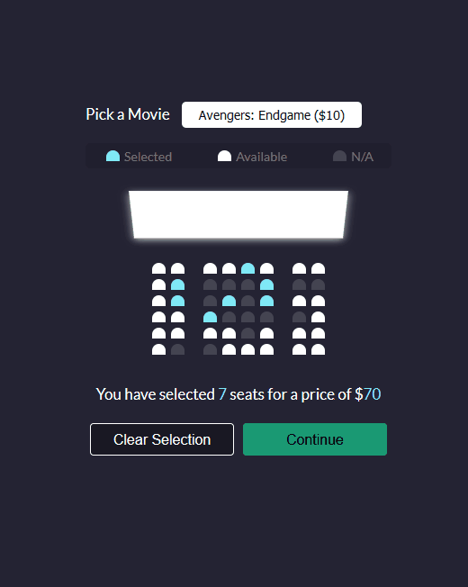

# Movie Seat Booking 

## Project Preview

## Summary
A movie seat selection UI with TS/Sass that uses local storage to persist data/selection in the browser. 

## How to Install
- `git clone` this repo
- No hard dependencies required to run so no need for `npm/yarn` installs. 
- Just open the `index.html` file or use server of your choice.
- Note: If modifying the file, and you have TS already installed, you can just call `tsc --watch` in the root project directory to compile your js into appropriate dir.
- I'd recommend using the VSCode Sass Plugin as well.  

## Project Todos
- Adding styling/logic around Continue button.  
- Enhance UI; maybe movie poster preview. 

## Project Insights
 - Using `nth-of-type()` and `last-of-type()`
- Also using `border-top-radius-right` and left for shaping the individual corners.
- using `:not(.className):hover` to control hover on things not of the specified type, in our case  
- using `perspective` property combined with rotateX to give a 3d-effect for the screen.
- I ran into a slight "bug" where we didn't have a fixed width for the container, making it grow/contract based on length of our p tag, so I added a min-width to the container.
- `localStorage` is quite simple to use, `setItem` and `getItem` for setting and getting values from localStorage. `localStorage.clear()` to clear all records stored.
